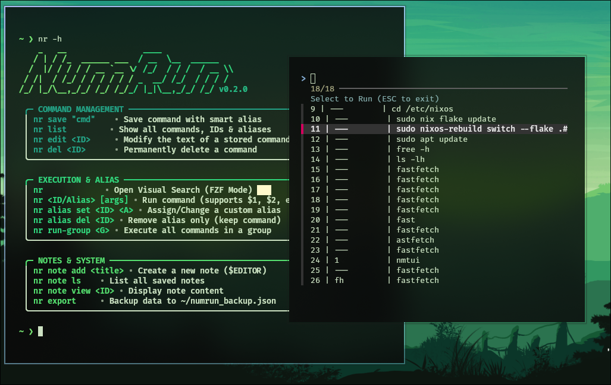

# 🚀 NumRun (v1.0.1)

**The Ultimate Smart Notebook for Terminal Users.**

NumRun is a productivity tool designed for developers who use the command line. It allows you to save complex commands, organize them into groups, and keep quick text notes—all without leaving your terminal.

[](https://www.python.org/)
[](https://opensource.org/licenses/MIT)
[](https://nixos.org)
[](http://makeapullrequest.com)

---

## ✨ Key Features

* **⚡ Instant Execution:** Run saved commands using their ID (e.g., `nr 1`).
* **📂 Batch Groups:** Organize commands into groups (e.g., `setup`, `deploy`) and run them sequentially with `nr run-group`.
* **📝 Quick Notes:** Built-in notebook to store snippets and reminders.
* **🛡️ Smart Guard:** Automatically detects dangerous keywords (`rm`, `dd`) and asks for confirmation.
* **🐍 No Dependencies:** Written in pure Python 3 using SQLite; works on NixOS without pip install.
* **💾 Data Portability:** Export your entire database to a JSON file for backup or sync.

---

## 🛠️ Installation

### 1️⃣ Quick Setup (Recommended)

```bash
git clone https://github.com/b2-3c/numrun
cd numrun
bash setup.sh
source ~/.bashrc  # or ~/.zshrc
```
Install the search utility: nix-env -iA nixos.fzf (or via your system's package manager).

---

## 📖 NumRun Shortcuts

| الأمر            | الوصف                                                |
| :--------------- | :--------------------------------------------------- |
| `nr [id/alias]`  | تشغيل أمر محفوظ باستخدام المعرف أو الاسم المستعار.   |
| `nr -c`          | عرض قائمة بجميع الأوامر المحفوظة في جدول.            |
| `nr c-a [cmd]`   | إضافة أمر جديد مع اقتراح اسم مستعار تلقائي.          |
| `nr -n`          | عرض قائمة بجميع الملاحظات المحفوظة.                  |
| `nr n-a [title]` | إضافة ملاحظة جديدة وفتح المحرر لكتابة محتواها.       |
| `nr e-n-c [id]`  | **(جديد)** تحرير محتوى ملاحظة موجودة.                |
| `nr -i`          | عرض معلومات النظام وإحصائيات الاستخدام.              |
| `nr s`           | البحث التفاعلي في الأوامر والملاحظات باستخدام `fzf`. |

---

### Example Usage

```bash
nr c-a "ls -la"
nr -c
nr 1
```

Smart Guard in action (prevents dangerous commands like `rm`):

```bash
⚠️ DANGER DETECTED. Confirm execution? (y/N)
```

---

## 📂 Project Structure

```
numrun/
├── numrun/                
│   ├── __init__.py        
│   ├── cli.py             
│   ├── database.py        
│   └── setup_completion.py
├── completions/           
│   ├── numrun.bash
│   └── numrun.zsh
├── pyproject.toml         
├── shell.nix              
├── setup.sh               
├── README.md              
└── LICENSE                
```

---

## 🤝 Contributing


---

## 📜 License

This project is licensed under the MIT License. See the `LICENSE` file for more information.
